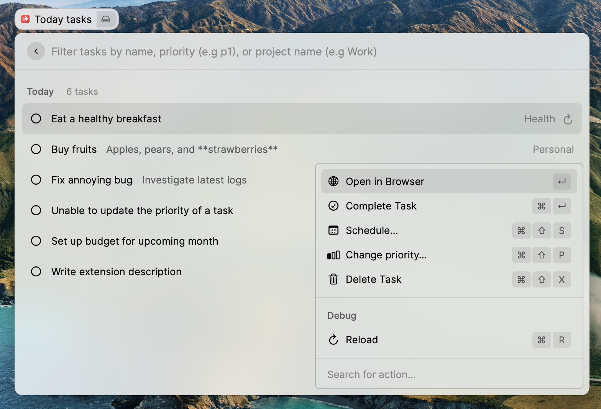

# Raycast x dœcentral

This extension brings dœcentral to Raycast so that you can check your today'S tasks easily. No more context-switching!

## Getting started

Before using the command, you need to retrieve your dœcentral API token. You can find it in the [API key settings view](https://app.dœcentral.com/?settings&apikeys).

## Features

- See your all your tasks due today
- See your all your tasks due tomorrow

For each task, you can:

- See if the task is recurring or not
- See the task's priority with a colored circle
- Open the task in source app (`⏎`)
<!--
- Complete the task (`⇧` + `⌘` + `C` or `⌘` + `⏎`)
- Schedule the task (`⇧` + `⌘` + `S`)
  - Today
  - Tomorrow
  - Next week
- Change its priority (`⇧` + `⌘` + `P`)
  - Low (`p1`)
  - Medium (`p2`)
  - High (`p3`)
  - Urgent (`p4`)
- Delete the task (`⇧` + `⌘` + `X`)
- Filter the tasks
  - By name
  - By priority: p1, p2, p3, p4
  - By project name if the list is date-based
-->

## Pro tips

Assign global hotkeys to commands so that you can quickkly access them. For example:

- `⌥` + `T` to see the "Today" view

## About

### Raycast

Raycast lets you control your tools with a few keystrokes. It’s designed to keep you focused. Learn more at https://www.raycast.com/

### dœcentral

dœcentral is a API-first task aggration service. Get your today's tasks from all your apps and services consolidated and centralized with just one API call. Learn more at https://www.dœcentral.com/

## For developer

To locally run this extension and make changes please check the [Getting started](https://developers.raycast.com/basics/getting-started) guide from Raycast.
